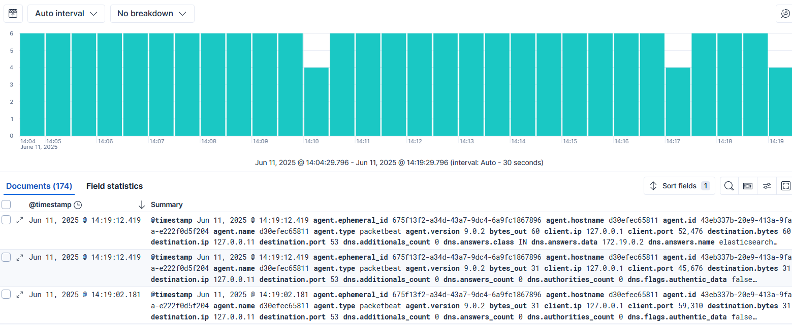
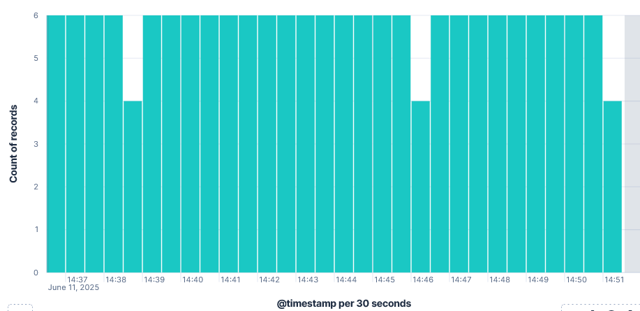
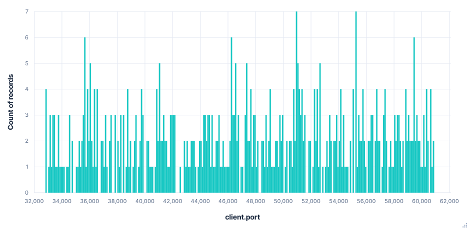
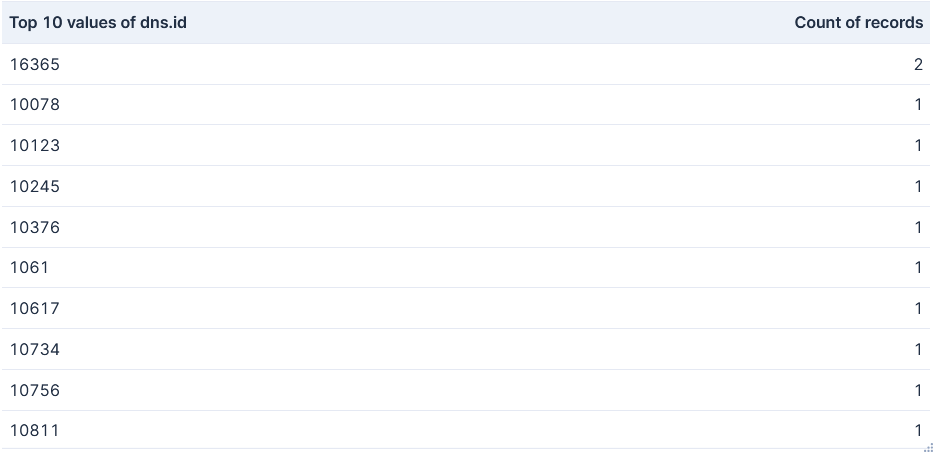
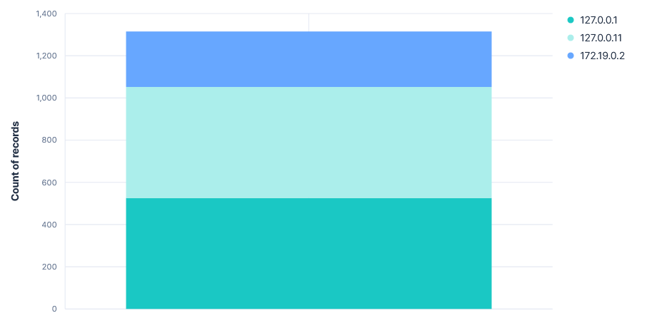
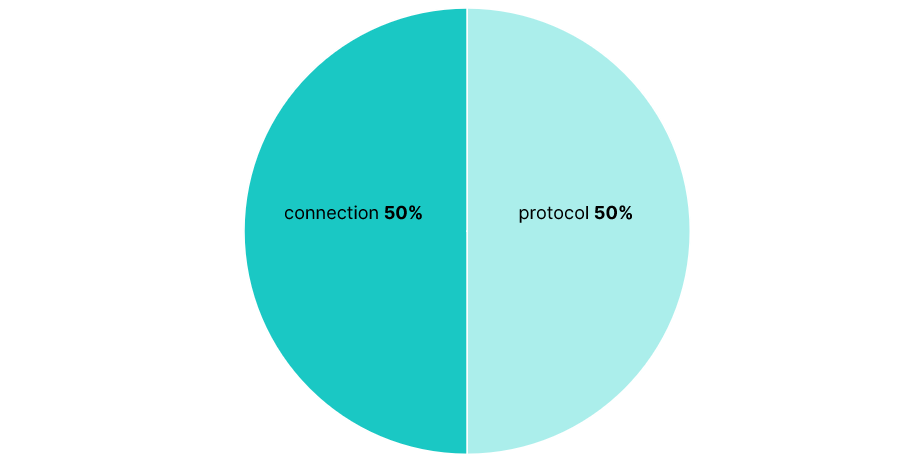

# Projet Sécurité : ELK + Packetbeat

Le but de ce projet est de créer une stack basée sur la suite ELK (Elasticsearch, Logstash, Kibana) connectée avec Packetbeat, afin d’analyser du trafic réseau à partir de fichiers PCAP.
Ce projet permet d’explorer l’intégration d’outils de monitoring réseau dans un environnement conteneurisé.  
  
L’environnement repose sur un fichier docker-compose.yml qui permet de déployer les services suivants dans un environnement Docker :  
    • Elasticsearch : Moteur d’indexation et de recherche  
    • Kibana : Interface de visualisation et de dashboarding  
    • Packetbeat : Agent léger de collecte de trafic réseau  
Les trois services communiquent entre eux via un réseau Docker interne (nommé ELK), ce qui simplifie la configuration et la portabilité de la solution.  
  
Les images officielles des différents services ont été utilisés pour des raisons de securité, dans leur dernière version (9.0.2).  


## Arborescence du projet
  
projet/  
├── docker-compose.yml               # Lancement des conteneurs ELK + Packetbeat  
├── packetbeat.yml                   # Configuration de Packetbeat  
├── readme.md                        # Documentation du projet  
├── assets/                          # Contient les captures d'écran pour le readme
├── PCAP/                            # Répertoire contenant les fichiers .pcap  
│   ├── test.pcap                    # Petit fichier de test  
│   └── 4SICS-GeekLounge-151022.pcap # PCAP principal à analyser  
├── dashboards/                      # JSON exportés de Kibana  
│   └── export.ndjson    
└── .gitignore                       # Fichiers ignorés (trop volumineux)  


## Commandes utiles :  
  
Il apparait parfois qu'il y ait des erreurs de permissions sur le fichier packetbeat.yml, notamment en travaillant sous Windows / WSL.  
Il faut alors copier le repertoire vers un dossier où l'on peut changer les droits (par exemple à la racine WSL) :  
```sh 
cp -r /mnt/c/Users/romd3/OneDrive/Documents/Telecom/707Securite/projet ~/
cd ~/projet/packetbeat
chmod 644 ./packetbeat.yml
cd ..
```

Lancer le docker compose depuis le repertoire projet :  
```sh 
docker-compose up -d
```

Lancer le PCAP :
```sh
docker exec -it packetbeat bash #rentrer dans le bash du docker packbeat
ls -l /usr/share/packetbeat/packetbeat.yml #vérifier que le .yml est bien présent (facultatif)
ls -l /pcap #vérifier que le dossier pcap est bien présent (facultatif)
curl http://elasticsearch:9200 #écouter sur le bon port, lance les data dans ELK
cat /usr/share/packetbeat/packetbeat.yml #si besoin ouvrir le fichier (facultatif)
```
  

## Dashboard  
graph 1 : Visualisation des paquets indexés au fil de l'eau



graph 2 : Nombre d'enregistrement au cours du temps



graph 3 : Nombre d'enregistrement par ports



graph 4 : Top 10 des DNS avec le plus d'enregistrement



graph 5 : Nombre d'enregistrement par IP



graph 6 : Ratio d'enregistrement par type


 

## Limitations :
Sur les versions récentes de Packetbeat :  
- les protocoles industriels (modbus, s7, smb, etc.) ne sont plus suppportés  
- le protocole SIP n’est plus supporté activement  
